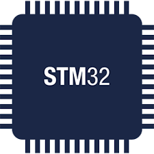

<h1>Mastering-Microncontroller-and-Embedded-Driver-Development</h1>

&nbsp;&nbsp;&nbsp;&nbsp;&nbsp;&nbsp;&nbsp;&nbsp;&nbsp;&nbsp;&nbsp;&nbsp;&nbsp;&nbsp;&nbsp;&nbsp;&nbsp;&nbsp;&nbsp;&nbsp;&nbsp;&nbsp;&nbsp;&nbsp;&nbsp;&nbsp;
&nbsp;&nbsp;

&nbsp;&nbsp;

Hi.&nbsp;👋🏻 &nbsp;**Well come.**&nbsp;
 

Welcome to the repository for the "Mastering Microcontroller and Embedded Driver Development" project! This repository serves as a centralized hub for all the code, examples, and resources related to the course.

 

### 📚 Content

1. Notes and Informations ✅

2. Development board used in our courses ✅

3. Hardware/Software Requirements ✅

4. IDE installation ✅

5. Creating a project using STM32CUBEIDE ⏳
 

### 💻  Technologies

• STM32CubeIDE

